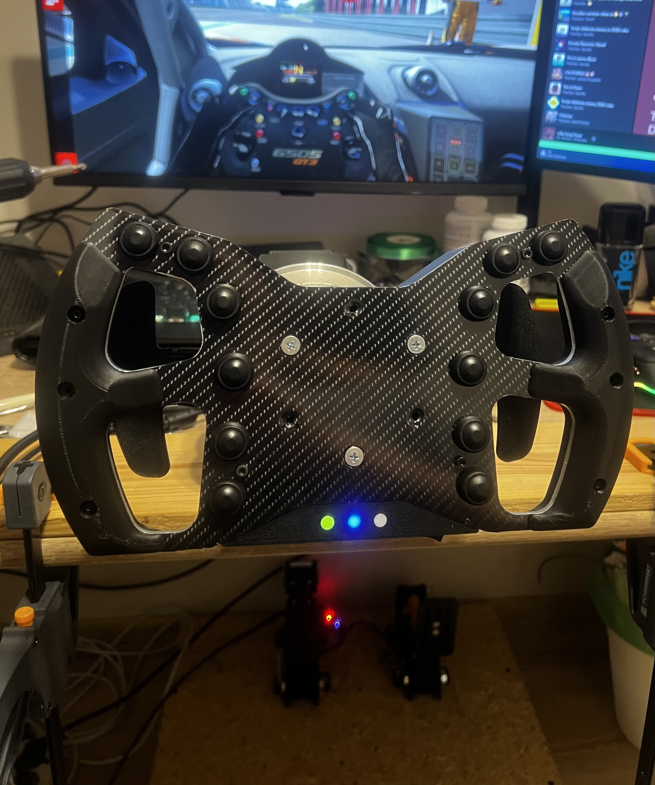
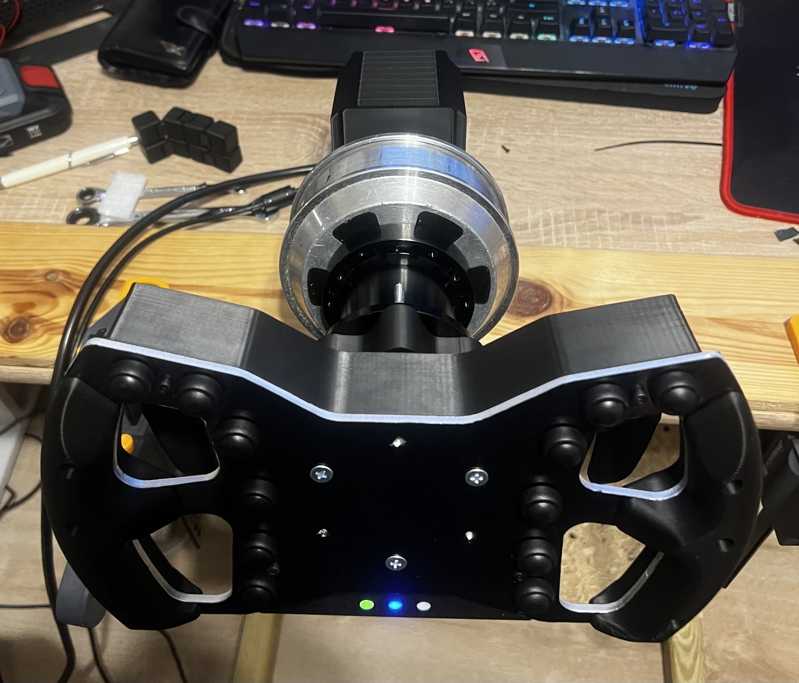
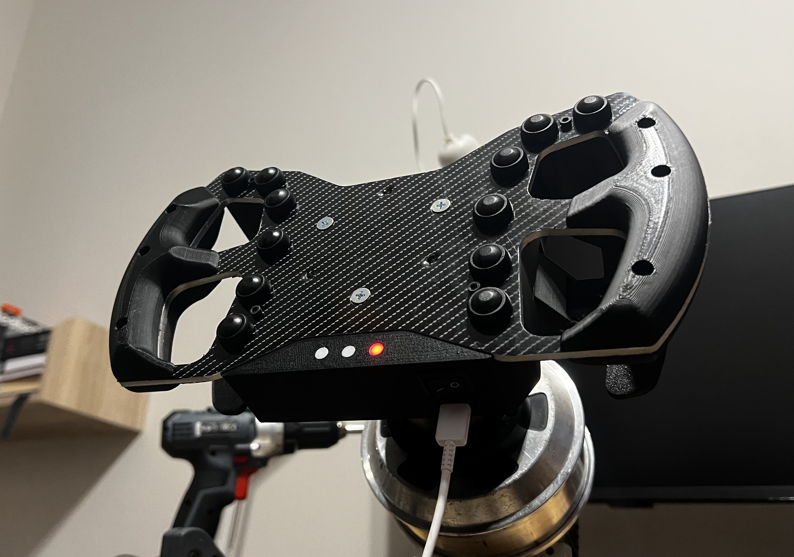

# DIY Direct Drive SimRacing Wheel & Pedals

**Authors:** Michał Leszczyński, Kamil Dobek, Nikodem Walkowiak  
**University:** Politechnika Poznańska (Poznan University of Technology) 

---

### Language / Język
* [PL Polski](#-zestaw-do-simracingu)
* [EN English](#-sim-racing-set)

---

# PL Zestaw do simracingu

## O projekcie

Celem projektu było zaprojektowanie i zbudowanie kompletnego, budżetowego systemu sterowania do symulatorów jazdy. System składa się z bazy kierownicy w technologii **Direct Drive** z mechanizmem sprzężenia zwrotnego, bezprzewodowej kierownicy oraz zestawu manipulatorów nożnych.

Projekt został zrealizowany jako zaliczenie z przedmiotu Systemy wbudowane. Głównym założeniem było stworzenie alternatywy dla komercyjnych rozwiązań, zachowując wysoki moment obrotowy (ok. 15Nm) i precyzję sterowania przy znacznie niższych kosztach.

## Galeria

### Zrealizowany układ

### Baza i Kierownica
Baza Direct Drive oparta na silniku z hoverboardu oraz kierownica bezprzewodowa.

### Manipulatory nożne
Widoczna konstrukcja mechaniczna pedałów gazu i hamulca z tensometrem.

---

## Funkcjonalności

### 1. Baza Direct Drive
* **Silnik:** Wykorzystano silnik bezszczotkowy odzyskany z hoverboardu, generujący ok. 15Nm momentu obrotowego.
* **Sterowanie:** Oparte na kontrolerze MKS XDRIVE mini zintegrowanym ze sterownikiem silnika.
* **Enkoder:** Magnetyczny MT6701 zamontowany w osi obrotu dla precyzyjnego odczytu położenia.
* **Chłodzenie i obudowa:** Projekt otwarty na modyfikacje (elementy drukowane 3D).

### 2. Kierownica
* **Komunikacja:** Bluetooth Low Energy (BLE) – brak plączącego się kabla podczas obrotu.
* **Interfejs:** 14 programowalnych przycisków funkcyjnych.
* **Sygnalizacja:** Diody LED informujące o stanie połączenia, parowania i ładowania.
* **Zasilanie:** Akumulator Li-Ion z modułem ładowania TP4056.

### 3. Manipulatory nożne
* **Komunikacja:** Przewodowa dla zapewnienia minimalnych opóźnień.
* **Gaz:** Oparty na precyzyjnym potencjometrze.
* **Hamulec (Load Cell):** Wykorzystuje belkę tensometryczną (120kg) oraz wzmacniacz HX711. Pozwala to na sterowanie siłą nacisku, co symuluje hydrauliczny układ hamulcowy i pozwala budować pamięć mięśniową.
* **Software:** Zaimplementowana filtracja sygnału, kalibracja oraz martwe strefy eliminujące szumy.

## Specyfikacja Sprzętowa

### Baza Direct Drive
* **Silnik:** Silnik od hoverboardu (ok. 15Nm) 
* **Kontroler:** MKS Xdrive mini 
* **Enkoder:** MT6701 
* **Zasilacz:** 24V 20.8A (500W) 

### Kierownica
* **Mikrokontroler:** ESP32-S3-NANO 
* **Zasilanie:** Stabilizator TPS63020, Moduł ładowania TP4056, Akumulator Li-Ion 
* **Przyciski:** 14 programowalnych przycisków 

### Manipulatory nożne
* **Mikrokontroler:** ESP32-S3-NANO 
* **Czujnik Hamulca:** Belka tensometryczna 120kg + Wzmacniacz HX711 
* **Czujnik Gazu:** Potencjometr liniowy 

## Technologie i biblioteki
Projekt oprogramowania został napisany z wykorzystaniem:
* **USBHIDGamepad** - obsługa komunikacji USB dla manipulatorów nożnych.
* **BleGamepad** - obsługa komunikacji Bluetooth dla kierownicy.
* **HX711** - obsługa belki tensometrycznej.

## Inspiracje i źródła

Niniejszy projekt powstał w oparciu o analizę istniejących rozwiązań Open Source oraz DIY.

* **Baza Direct Drive:** Wzorowana na projekcie [FFBeast](https://ffbeast.github.io/docs/en/wheel.html).
* **Kierownica:** Projekt mechaniczny i design inspirowany [projektem z Thingiverse](https://www.thingiverse.com/thing:4891321).
* **Manipulatory nożne:** Konstrukcja mechaniczna wzorowana na [DIY Sim Racing Pedals](https://www.diysimstudio.com/product/diy-sim-racing-pedals/).

---
---

# EN Sim Racing Set

## About the project

The goal of the project was to design and build a complete, budget-friendly control system for racing simulators . The system consists of a **Direct Drive** wheel base with a force feedback mechanism, a wireless steering wheel, and a set of pedals .

The project was realized as a final assignment for the Embedded Systems course. The main assumption was to create an alternative to commercial solutions, maintaining high torque (approx. 15Nm) and control precision at a significantly lower cost .

## Gallery

### Full Setup

### Base & Wheel
Direct Drive base powered by a hoverboard motor and a custom wireless wheel.

### Pedals
Mechanical construction of throttle and load cell brake pedals .

---

## Features

### 1. Direct Drive Base
* **Motor:** Used a brushless motor salvaged from a hoverboard, generating approx. 15Nm of torque.
* **Control:** Based on the MKS XDRIVE mini controller integrated with the motor driver.
* **Encoder:** Magnetic MT6701 mounted on the rotation axis for precise position reading.
* **Cooling and Housing:** Project open to modifications (3D printed elements).

### 2. Steering Wheel
* **Communication:** Bluetooth Low Energy (BLE) - no tangling cables during rotation.
* **Interface:** 14 programmable functional buttons.
* **Signaling:** LEDs indicating connection and pairing status.
* **Power Supply:** Li-Ion battery with TP4056 charging module.

### 3. Pedals
* **Communication:** Wired (USB) to ensure minimal latency.
* **Throttle:** Based on a precise potentiometer.
* **Brake (Load Cell):** Uses a load cell (120kg) and HX711 amplifier. This allows control via pressure force, simulating a hydraulic braking system and enabling muscle memory building.
* **Software:** Implemented signal filtering, calibration, and deadzones to eliminate noise.

## Hardware Specification

### Direct Drive Base
* **Motor:** Hoverboard motor (approx. 15Nm) 
* **Controller:** MKS Xdrive mini 
* **Encoder:** MT6701 
* **Power Supply:** 24V 20.8A (500W) 

### Steering Wheel
* **Microcontroller:** ESP32-S3-NANO 
* **Power:** TPS63020 Regulator, TP4056 Charger, Li-Ion Battery 
* **Buttons:** 14x Tactile Switch 

### Pedals
* **Microcontroller:** ESP32-S3-NANO 
* **Brake Sensor:** Load Cell 120kg + HX711 Amplifier 
* **Throttle Sensor:** Linear Potentiometer 

## Technologies and Libraries
The software was written using:
* **USBHIDGamepad** - USB communication support for the pedals.
* **BleGamepad** - Bluetooth communication support for the steering wheel.
* **HX711** - load cell support.

## Inspirations and Credits

This project was based on the analysis of existing Open Source and DIY solutions.

* **Direct Drive Base:** Modeled after the [FFBeast](https://ffbeast.github.io/docs/en/wheel.html) project.
* **Steering Wheel:** Mechanical design inspired by [this project from Thingiverse](https://www.thingiverse.com/thing:4891321).
* **Pedals:** Mechanical construction modeled after [DIY Sim Racing Pedals](https://www.diysimstudio.com/product/diy-sim-racing-pedals/).
